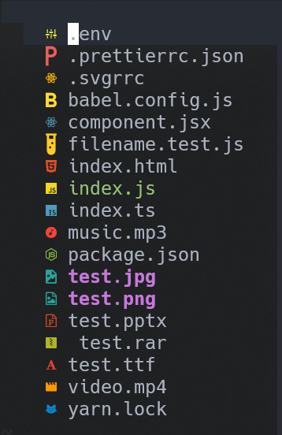

# Nvim-material-icon

## 277 file types supported

An improved version of [nvim-web-devicons](https://github.com/nvim-tree/nvim-web-devicons)

## Image



## Warning ⚠️⚠️

You need [DaikyXendo/nvim-tree.lua](https://github.com/DaikyXendo/nvim-tree.lua) instead of [nvim-tree/nvim-tree.lua](https://github.com/nvim-tree/nvim-tree.lua)

## Requirements

-   [Nerd fonts](https://www.nerdfonts.com/)

## Installation

```vim
Plug 'DaikyXendo/nvim-material-icon'
```

or with [packer.nvim](https://github.com/wbthomason/packer.nvim)

```lua
use 'DaikyXendo/nvim-material-icon'
```

## Usage

### Setup

This adds all the highlight groups for the devicons
i.e. it calls `vim.api.nvim_set_hl` for all icons
this might need to be re-called in a `Colorscheme` to re-apply cleared highlights
if the color scheme changes

```lua
require'nvim-material-icon'.setup {
  -- your personnal icons can go here (to override)
  -- you can specify color or cterm_color instead of specifying both of them
  -- DevIcon will be appended to `name`
  override = {
    zsh = {
      icon = "",
      color = "#428850",
      cterm_color = "65",
      name = "Zsh"
    }
  };
  -- globally enable different highlight colors per icon (default to true)
  -- if set to false all icons will have the default icon's color
  color_icons = true;
  -- globally enable default icons (default to false)
  -- will get overriden by `get_icons` option
  default = true;
}
```

### Get Icon

Get the icon for a given file by passing in the `name`, the `extension` and an _optional_ options `table`.
The name is passed in to check for an exact match e.g. `.bashrc` if there is no exact name match the extension
is used. Calls `.setup()` if it hasn't already ran.

```lua
require'nvim-material-icon'.get_icon(filename, extension, options)
```

The optional `options` argument can used to change how the plugin works the keys include
`default = <boolean>`. If the default key is set to true this function will return a default
if there is no matching icon
e.g.

```lua
require'nvim-material-icon'.get_icon(filename, extension, { default = true })
```

You can check if the setup function was already called with:

```lua
require'nvim-material-icon'.has_loaded()
```

### Get icon and color code

`get_icon_color` differs from `get_icon` only in the second return value.
`get_icon_cterm_color` returns cterm color instead of gui color
`get_icon` returns icon and highlight name.
If you want to get color code, you can use this function.

```lua
local icon, color = require'nvim-material-icon'.get_icon_color("init.lua", "lua")
assert(icon == "")
assert(color == "#51a0cf")
```

### Get all icons

It is possible to get all of the registered icons with the `get_icons()` function:

```lua
require'nvim-material-icon'.get_icons()
```

This can be useful for debugging purposes or for creating custom highlights for each icon.

### Set an icon

You can override individual icons with the `set_icon({...})` function:

```lua
require("nvim-material-icon").set_icon {
  zsh = {
    icon = "",
    color = "#428850",
    cterm_color = "65",
    name = "Zsh"
  }
}
```

You can override the default icon with the `set_default_icon(icon, color)` function:

```lua
require("nvim-material-icon").set_default_icon('', '#6d8086')
```

### Getting icons by filetype

You can get the icon and colors associated with a filetype using the `by_filetype` functions:

```lua
require("nvim-material-icon").get_icon_by_filetype(filetype, opts)
require("nvim-material-icon").get_icon_colors_by_filetype(filetype, opts)
require("nvim-material-icon").get_icon_color_by_filetype(filetype, opts)
require("nvim-material-icon").get_icon_cterm_color_by_filetype(filetype, opts)
```

These functions are the same as their counterparts without the `_by_filetype` suffix, but they take a filetype instead of a name/extension.

You can also use `get_icon_name_by_filetype(filetype)` to get the icon name associated with the filetype.
